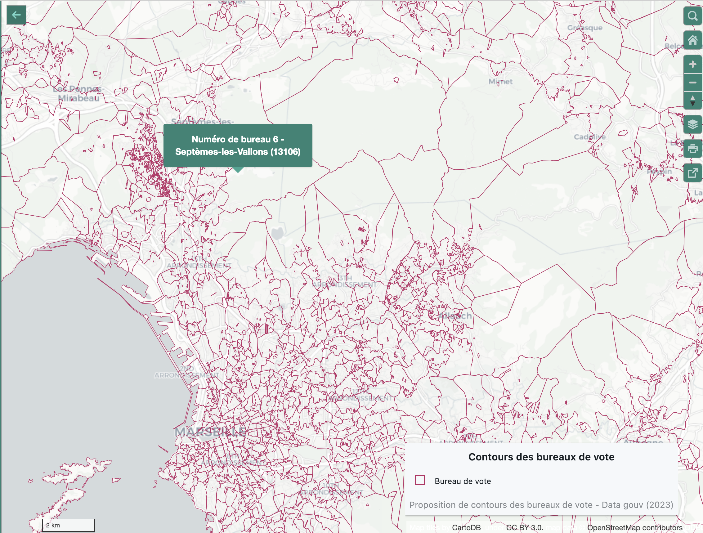

```{r, echo=FALSE}
library(metathis)
meta() %>% 
  meta_description(params$event) %>% 
  meta_name("github-repo" = paste0("datactivist/", params$slug)) %>% 
  meta_viewport() %>% 
  meta_social(
    title = params$title,
    url = paste0("https://datactivist.coop/", params$slug),
    image = params$image,
    image_alt = params$image_alt,
    og_type = "website",
    og_author = "Datactivist",
    og_locale = "fr_FR",
    og_site_name = "Datactivist",
    twitter_card_type = "summary",
    twitter_creator = "@datactivi_st")

```

layout: true

<style>
.remark-slide-number {
  position: inherit;
}

.remark-slide-number .progress-bar-container {
  position: absolute;
  bottom: 0;
  height: 4px;
  display: block;
  left: 0;
  right: 0;
}

.remark-slide-number .progress-bar {
  height: 100%;
  background-color: #e95459;
}

</style>


`r paste0("<div class='my-footer'><span>", params$event, "</span> <center><div class=logo><a href='https://datactivist.coop/'></a></div></center></span></div>")` 


---

class: center, middle

These slides online : `r paste0("http://datactivist.coop/", params$slug)`

Sources : `r paste0("https://github.com/datactivist/", params$slug)`


Datactivist's productions are freely reusable under a [Creative Commons 4.0 BY-SA licence](https://creativecommons.org/licenses/by-sa/4.0/legalcode.fr).

<BR>
<BR>


---
### France has a first-class electoral data-collection process

.center[
.reduite[
[](https://www.unehistoireduconflitpolitique.fr/)
]
]


---
### France has a first-class electoral data-collection process

Data are:
- reliable
- exhaustive
- open
- free
- timely 
- fine-grained (36k *communes*, 70k *bureaux de vote* (voting stations))

And we have nice, long time-series ([*communes* since 1992, *bureaux de vote* since 2002](https://www.data.gouv.fr/fr/pages/donnees-des-elections/)).


---

### And now we have voting stations-level geographical data


[](https://www.data.gouv.fr/fr/datasets/bureaux-de-vote-et-adresses-de-leurs-electeurs/)

---


### However it is very hard to use these data


- The data are not available in a single place
- The data are not available in a single format (and the format is [very often not truly machine-readable](https://github.com/joelgombin/lireMininterieur))
- the geographical units change over time (see [COGugaison](https://github.com/antuki/COGugaison))
- there is no univocal way of describing candidates and parties - which also change a lot over time

Therefore, it is a lot of work to use these data, for a one-off analysis and even more for longitudinal analyses.


---

### We need a modern way of publishing these data

- A single place to find the data
- both batch files and API
- semantic data? (linked to Wikidata for example)

**Not a project (yet?)... but something I've been thinking about for years.**

**Interested?**


---
class: inverse, center, middle

# Thank you!

Contact : [joel@datactivist.coop](mailto:joel@datactivist.coop)


